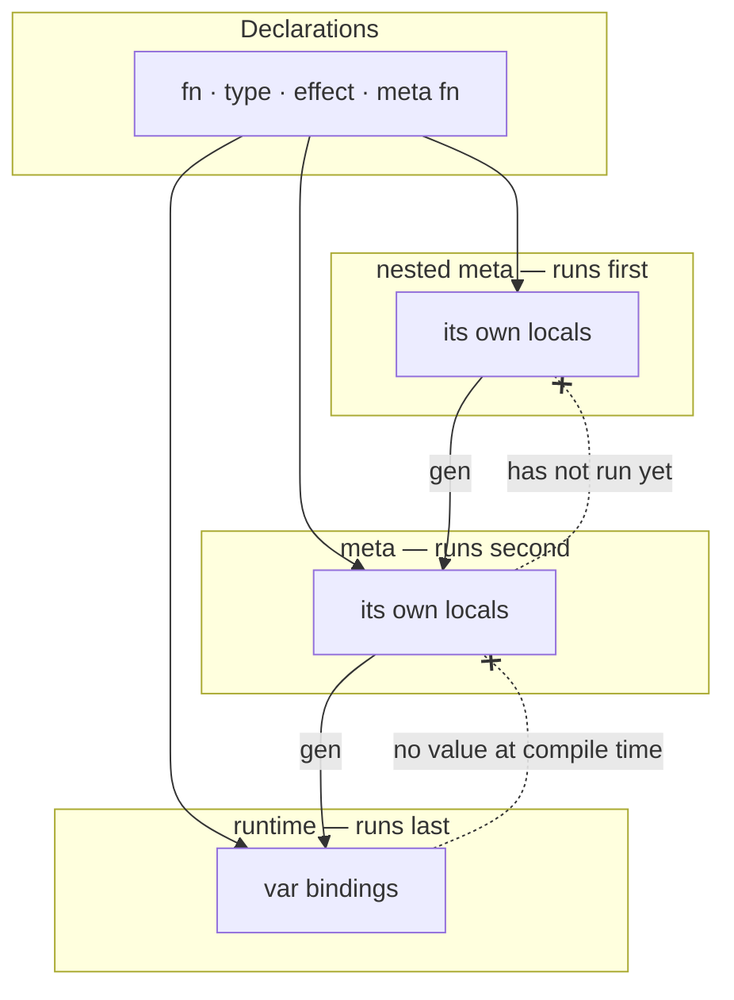
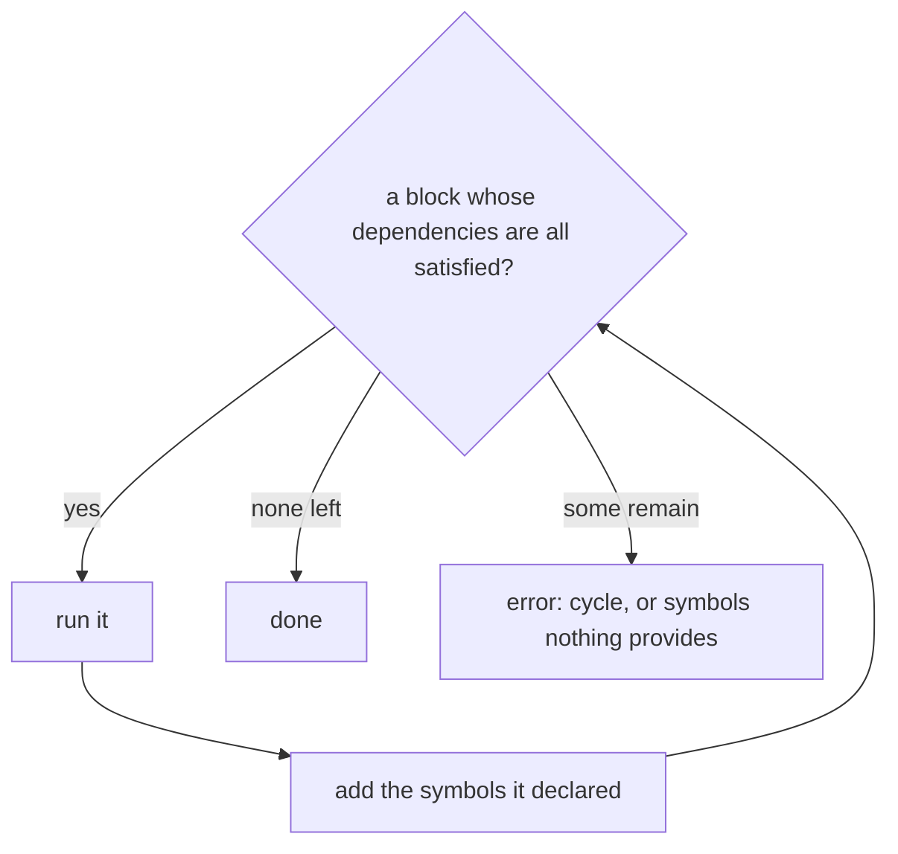

# Metaprocessing

Status: **built.** `lib/metaprocess.ml` runs `meta` blocks and `meta fn` calls and splices what `gen` emits; `tests/meta/` passes except `derive/basic`, which predates the type redesign. A meta function's parameters take values, like any other function's.

A `meta` block runs while the program is being compiled. Reaching one means compiling and running its dependencies, then continuing where compilation left off — so metaprocessing is recursive compilation.

**Literally so.** `Metaprocess` calls Desugar, Value_mono, Typecheck, Type_mono, Resolve, Reflect, Cps, Verify and Interp on the block's statements — the same passes, in the same order, that the rest of the program goes through. There is no second interpreter and no compile-time subset of the language.

## Two things, not one

**`meta` runs code at compile time.** Braces are a block of statements rather than part of the form, so `meta print(x);` and `meta { … }` are the same thing at different sizes. Its output happens during compilation, before the program runs at all:

```cronyx
print("Top");
meta {
    print("Middle");
}
print("Bottom");
```

```
Middle
Top
Bottom
```

**`gen` emits code into the program.** The statement after it is captured as syntax and spliced in at the meta block's position, so it runs at runtime like anything else:

```cronyx
print("Top");
meta {
    gen print("Middle");
}
print("Bottom");
```

```
Top
Middle
Bottom
```

Same block, one keyword apart, opposite ordering. `gen` outside a meta block is an error.

## What `gen` captures

Raw AST, not a value — but every name in it is checked against the meta environment on the way out.

**If the name is not bound at compile time**, it is emitted as an identifier and resolved later, in the program the code is spliced into.

**If it is bound**, its value is *reified* — turned back into the syntax that denotes it. A number becomes a literal, a list becomes a list literal, a struct becomes a struct literal.

**If its type cannot be reified**, that is an error at the `gen`. A closure has no literal form, and neither does anything else whose value cannot be written down.

Reifiability is derived from the type rather than declared: a value is reifiable when everything inside it is, and a function is where that bottoms out. Nothing is written to opt in. See [Reify](Reify.md).

```cronyx
var y = 4;
meta {
    gen var x = y + 5;
}
print(x);        // 9
```

`y` is a runtime variable, so it is not bound at compile time. It stays `y`, and `y + 5` is evaluated at runtime.

Whereas a meta-bound name is written out as its value:

```cronyx
meta {
    var names = ["alice", "bob"];
    gen print(names);
}
```

emits `print(["alice", "bob"])`.

Compare a meta-bound name, which is baked in:

```cronyx
meta fn derive(T) {
    gen fn type_name(self) -> string {
        return T.name;
    }
}
```

`T` is a meta parameter, so it is substituted while collecting.

Substitution also reaches **name positions** — a declaration's name, a call's callee, a struct type — which is what makes generated declarations possible. A meta variable holding a string becomes the identifier:

```cronyx
meta {
    var names = ["alice", "bob", "charlie"];
    for (name in names) {
        var fn_name = "greet_" + name;
        gen fn fn_name() {
            print("Hello " + name);
        }
    }
}

greet_alice();
greet_bob();
greet_charlie();
```

```
Hello alice
Hello bob
Hello charlie
```

`fn_name` is not the function's name; its *value* is. Each turn of the loop emits a declaration called `greet_alice`, `greet_bob`, `greet_charlie`, with `name` baked into each body as a literal.

So a name in generated code is an identifier unless the meta environment binds it to a string, in which case it is that string. The same rule covers both positions: only string bindings substitute into names, and only scalar bindings substitute into expressions.

**The emitted nodes do not go through the rest of compilation inside metaprocessing.** They are handed back to the enclosing compilation and continue from the stage the meta block interrupted. Generated code is checked and lowered exactly once, as part of the program it lands in.

### How a captured statement reaches the interpreter

`gen` has to run when control reaches it — inside a loop, inside a branch — so it is a runtime construct in the block's compiled program. But what it carries is *surface syntax*, and every IR after the front end has dropped that shape.

So a `gen` does not survive as a node. Captured statements go into a table the metaprocessor owns, and `gen S` lowers to a call:

```
gen S    ⟶    meta#emit(k, "n", n, …)
```

`k` indexes the table; the pairs are the block's own bindings and their values. `meta#emit` looks up entry `k`, substitutes, and appends the result to whatever collector is running. The name is generated, so no program can write it, and it is bound only while a block runs.

**Which names get passed is a correctness matter.** Only names the block itself binds are sent, because a name it does *not* bind is a runtime name — mentioning it inside the meta block would not compile. That is precisely why `gen var x = y + 5;` works: `y` is never passed, so it is never substituted, and it survives as an identifier.

The table is shared across the whole run rather than per block, because a `meta fn` body may contain `gen` and is recorded once but called from many blocks.

### What substitutes

A bare identifier bound by the meta program is replaced; everything else is syntax, resolved in the program the code lands in. What the identifier holds decides how:

| It holds | It becomes |
|---|---|
| `int`, `float`, `string`, `bool`, `char` | that literal |
| `Code` | the syntax it captured |
| `Name` | an identifier, in a name position |
| anything else | itself, unsubstituted |

**Only a bare identifier splices.** `self.eq(other)` inside a `code` is a call in the generated program, not a call to make now, and that holds however the callee is defined. It is what keeps the question *does this run now or later* from depending on resolving a name — which is also why a computed piece is bound to a local first:

```cronyx
var one = compare(f.name);
check = code(check and one);
```

A **name position** — a declaration's name, a constructor's type, a field, a method, a type annotation — substitutes only for a `Name`. A string never becomes an identifier on its own; `"greet_" + n` has to say so, with `.as_name()`, which rejects text that could not be one. That is the same objection that rules out passing a type as a string: characters carry no guarantee that anything answers to them.

A list does not become a list literal, and a record does not become a record literal. No fixture needs it — `greeting.cx` iterates the list while compiling and substitutes one name at a time.

## Nesting

A meta block inside a meta block is processed while the outer one is being compiled, so the innermost runs first:

```cronyx
print("A");
meta {
    print("B");
    meta {
        print("C");
    }
    print("D");
}
print("E");
```

```
C
B
D
A
E
```

`C` during the compilation of the outer block, `B` and `D` when that block runs, `A` and `E` at runtime.

## Processing is unconditional

Because a nested block is processed while the enclosing one is compiled, the enclosing block's control flow has no bearing on whether it runs:

```cronyx
meta {
    if (false) {
        meta { print("C"); }
    }
}
```

```
C
```

`C` is printed while compiling the outer block. The outer block then runs, evaluates `false`, and does nothing.

Three separate things, worth keeping apart:

- **Processing** a nested meta block happens during compilation of its parent, unconditionally.
- **Splicing** puts `gen` output at the position the meta block occupied — which, for a nested block, is inside the parent's body rather than in the program. A generated *declaration* is the exception: it hoists to the front of the program, because what generated it may stand below the code that uses it. `gen_symbol.cx` calls `greet` on line 1 and generates `fn greet` from a block below.
- **Executing** spliced code follows ordinary control flow, so a statement generated inside a branch that is never taken never runs.

So control flow decides what *executes*, never what gets *processed*.

A meta block **inside a `gen`** is still a nested block, so it is processed now and its output takes its place — inside the `gen`, which is where it stood. That is what makes `gen_meta.cx` print `D` first: the inner block runs during the outer's compilation, and the `gen print("E")` it produced is what the outer block emits when it runs. Treating the inner block as ordinary captured syntax instead gives `B F D …`, which is the wrong answer and the one this section exists to rule out.

## Meta functions

A call to a `meta fn` is evaluated during metaprocessing, and the call is replaced by whatever it produced. What that means depends on position:

```cronyx
meta fn fib(n) { ... }

var x = fib(10);          // expression: replaced by 89, reified
```

```cronyx
meta fn derive_name(T) {
    gen fn type_name(self) -> string { return T.name; }
}

derive_name(Dog);         // statement: replaced by the gen output
```

### Where the `meta` goes

`meta` always means the same thing — run this while compiling. The only question is where it is written, and that answers two different needs.

**On the call.** `meta fib(10)` asks for an ordinary function's result now. `fib` is a plain `fn`, equally useful at runtime, and the call site decides.

**On the declaration.** `meta fn f(…)` makes every call to `f` a meta call, with nothing written at the call sites. That is required rather than convenient: `print(a, b)` cannot become `meta print(a, b)` everywhere, so a function whose whole purpose is to expand has to say so once, where it is declared. It has no runtime form, because every call to it has already happened by then.

Neither is a separate mechanism, and neither is a macro system: both are Cronyx running Cronyx, and the difference is only who says *when*.

`tests/meta/functions/fib` puts `meta` on the declaration for a computation, which is the wrong lesson — it makes a perfectly ordinary recursive function compile-time-only for no gain. It wants rewriting to a plain `fn` and a `meta` call.

### Parameters take values

A meta function's parameters are ordinary parameters. They receive values, evaluated in the meta program, because a meta function is an ordinary function that has been reduced away before the program runs. Nothing takes syntax, and there are no syntax objects in the language.

That is the simplifying decision, and it decides two other things by itself.

**A type must be a value to be passed as one.** `derive(Dog)` cannot take a bare name, and `typeof` only takes a value. So `derive` is not waiting on metaprocessing — a deriver works today over a `TypeShape` — but on naming the type it is written for.

**`print` cannot become a meta function.** `print(a, b)` with `a` a runtime variable is not reducible at compile time: the argument has no value yet, and the call fails with `Undefined variable 'a'`, which is correct rather than a gap. Moving `print` out of `builtins.ml` therefore needs rest parameters, a top type, or a one-argument `print` — and not this.

Four rules follow:

- **Arguments must be known at compile time.** `fib(read_int())` is an error naming the argument.
- **Meta functions may call ordinary functions.** The boundary is *when* code runs, not which code.
- **Meta function names do not exist at runtime.** `var f = fib;` is an error; there is nothing to bind.
- **Results must be reifiable**, the same restriction `gen` substitution has.
- **Calls are not memoized.** Calling a meta function a hundred times evaluates it a hundred times.
- **One call may do both** — return a value *and* `gen` declarations. Both land at the call site: the value replaces the call, the generated nodes are spliced beside it.

`meta fn f(n)` and `fn f<n: int>()` both demand compile-time arguments, so it is worth being clear about the difference:

| | `meta fn f(n)` | `fn f<n: int>()` |
|---|---|---|
| Body runs | at compile time | at runtime |
| Call site becomes | the result | a call to a specialized copy |
| Emits code | via `gen` | no |
| Exists at runtime | no | one copy per argument |

`meta fn` produces code or values. `<>` specializes code.

## Symbol resolution

This is the part that differs most from ordinary compilation. Normally a pass sees the whole program; a meta block sees only what exists at the moment it runs.

Three things run at three different times, and what each can see follows from that:



Declarations reach every level, because they are compiled from the dependency graph rather than bound by execution. Everything else is bound by something running, and the arrows only point one way: an earlier stage cannot see what a later one will bind.

`gen` is the only edge that crosses a level, and it crosses in the other direction — code written at one level is placed in the one that runs after it.

| Visible to a meta block                      |     |                                    |
| -------------------------------------------- | --- | ---------------------------------- |
| file-level `fn`, `type`, `effect`, `meta fn` | yes | compiled as dependencies           |
| its own locals                               | yes | it is running                      |
| an enclosing meta block's locals             | no  | that block has not run             |
| runtime `var` bindings                       | no  | they have no value while compiling |
| declarations below it in the file            | no  | a block sees the program as compilation reached it |
| imported symbols                             | yes | a unit's declarations are one program by then |
| symbols another meta block generated         | yes | if that block stands above it     |

**Runtime variables are not in scope.** `var y = 4;` has no value while compiling — it is a binding the program will make later. That is exactly why `gen var x = y + 5;` works: `y` is unbound at compile time, so it passes through as an identifier.

**A nested block cannot evaluate its parent's locals.** It is processed *before* the enclosing block runs, so anything the parent binds does not exist yet, and referring to it is an error:

```cronyx
meta {
    var msg = "hello";
    meta {
        print(msg);        // error: msg is not bound
    }
}
```

`gen` is the way across, because it does not evaluate `msg` — it emits the identifier. The emitted code lands in the parent's body, and by the time the parent runs, `msg` is bound:

```cronyx
meta {
    var msg = "hello";
    meta {
        gen print(msg);    // prints "hello" when the outer block runs
    }
}
```

That is what lifting a level means. The nesting is lexical, the ordering is not, and `gen` is what moves code from one to the other.

### Generated symbols

A meta block may use what another one generated. That is what makes metaprogramming compose, and it is the hardest part of the design, because the dependency is not visible until the generating block has run.

Two kinds of use, with different consequences:

**Resolved after metaprocessing.** Ordinary code referring to a generated symbol imposes no ordering — every meta block has finished by the time names are resolved, so a call may sit above the block that generates it, and the generated name may be computed:

```cronyx
greet_alice();

meta {
    var names = ["alice", "bob"];
    for (name in names) {
        var fn_name = "greet_" + name;
        gen fn fn_name() { print("Hello " + name); }
    }
}
```

**Needed in order to run.** A meta block calling a generated function must wait for the block that generates it. Ordering follows whatever can be seen statically, and when that is not enough the block runs against a symbol that does not exist yet, which is an error naming the symbol.

No rule restricts what may be generated. A block whose generated names are computed simply cannot be depended on by another block, and finding that out is an error rather than a rejection at the definition. Execution order can get smarter later; the failure is the honest answer until it does.

Processing is a worklist rather than a single ordering:



Two ways it ends badly, and they need different messages. A **cycle** — A needs what B generates and B needs what A generates — should report the chain, `A → B → A`, not a set. **Stuck** blocks that are not cyclic are waiting on a name nothing provides, and the message should name the symbol rather than the block.

Improving the order later only turns errors into successes, never changing what a working program means. Nothing about generation is order-sensitive, because generated code is not a category of its own: once metaprocessing is done, `meta` is gone and the emitted declarations are ordinary ones. Two blocks generating the same name is the same error as writing the same name twice by hand, checked on the finished program by the ordinary rule, and no order avoids it.

**Generated symbols resolve late.** Because names are resolved after all metaprocessing, generated code can be referenced from anywhere in the unit, including above the block that generates it:

```cronyx
greet("Brendan");

meta {
    gen fn greet(name) {
        print("Hello, " + name);
    }
}
```

## Generated code is ordinary code

Once metaprocessing finishes, `meta` and `gen` are gone and what they emitted is indistinguishable from what was written by hand. Everything downstream follows from that rather than needing its own rule:

- Two blocks generating the same name is the same error as writing that name twice.
- A generated `var x` binds the same `x` any surrounding code binds. There is no hygiene mechanism because there is no separate category of name.
- Generated code is type checked, elaborated, and lowered by the ordinary passes, once, as part of the program it landed in.

## The evaluator is a parameter

Metaprocessing does not contain an evaluator; it takes one. Anything that can run the compiled form will do — today the tree-walking interpreter, later codegen plus a runtime, or something else entirely.

That keeps the recursion honest: compiling a meta block runs the same pipeline the program uses, and the thing at the end of that pipeline is supplied rather than assumed. It also puts limits where they belong. A step budget for runaway compile-time computation is the evaluator's business, not the compiler's, and until it becomes a problem an infinite loop in a meta block is a developer error like any other infinite loop.

The same applies to what compile-time code may do. It can do anything the evaluator permits. Restricting file access or nondeterminism is a sandboxing decision for whatever is passed in, not a rule the language needs to state.

## `code` builds syntax, `gen` emits it

`gen` is a side effect: what follows it goes into the program being compiled. `code(e)` is a value — it hands back the syntax without running it, and nothing is emitted until a `gen` takes it.

```cronyx
meta fn build() {
    var check = code(true);
    for (n in [1, 2, 3]) { check = code(check and n > 0); }
    gen fn all_positive() -> bool { return check; }
}
```

`check` is an ordinary local holding a `Code`. The fold is what joins the pieces, so there is no `join`, no operator-as-a-value, and no control flow inside `gen` — the loop that builds the code is the loop the language already has, which is the point. A template with a repetition marker can only repeat what the marker anticipated; this can sort the fields, skip one, or call a helper.

That helper is a meta function, because a function that manipulates syntax runs while compiling by definition:

```cronyx
meta fn doubled(v: Code) -> Code { return code(v + v); }
```

**`Code` and `Name` are compile-time types**, next to `Type`. A `Code` cannot reach a running program — `code` outside a meta block is an error, and nothing else builds one. A `Name` is ordinary once it is in hand; what is restricted is making one, since that is where a name could otherwise be forged.

**How it is built.** `code` reuses what `gen` already had. Both are lowered before the meta program runs — into a call carrying an index into a table of captured syntax, plus the meta-bound names in scope. `gen`'s call emits, `code`'s returns. The one difference is scope: lowering follows the names bound *up to that point*, because `var body = code(…)` cannot be handed `body`.

## Deriving

Generating an `impl` from a type's shape is what a meta function is for, and it is the case the language should be good at: real code derives several traits at once, so the form takes a list and names the type once.

```cronyx
derive Eq, Ord, Hash, Clone, Debug for Dog;
```

A deriver is declared beside the trait it derives, bound to it by a `for` clause the way an `impl` is:

```cronyx
trait Hash {
    fn hash(self) -> int;
}

meta fn derive(shape: TypeShape) for Hash {
    match shape {
        TypeShape::Product(t, fields) => {
            gen impl Hash for t {
                fn hash(self) -> int { … built with `code`, above … }
            }
        }
        …
    }
}
```

**It takes a `TypeShape`, not a `Type`.** A `Type` cannot be passed anywhere — it answers a question where it stands — so `derive A for X;` passes `typeof(X).shape`, and the name of the type comes out of the shape with the fields. Handing over a whole `Type` waits on the lazy handle, and nothing here needs it.

`derive A, B for X;` is one call per trait. Nothing else is new: a generated `impl` is spliced and hoisted like any other generated declaration, and it is checked as ordinary code in the program it lands in.

**The name written is not the name registered.** Every deriver is called `derive`, which would collide; `for Hash` is what registers it, under a generated name no program can write. So a second deriver for one trait is *trait 'Hash' already has a deriver*, and a `derive` naming a trait without one is *trait 'Hash' has no deriver* — both while metaprocessing, rather than as a missing method later.

**Why `for Hash` rather than a member of the trait.** Binding by a clause keeps a trait what it is — signatures — and makes a mistyped trait name an error at the declaration rather than a derive that silently does not exist. It also allows a deriver for a trait you did not write, which the alternative cannot: there are no orphan rules here, so `derive Hash for geom.Point;` is as legitimate as writing the impl by hand. Duplicate derivers for one trait are rejected the way duplicate impls are.

**Why a statement rather than an attribute on the declaration.** `derive … for …` can name an imported type, does not touch the type-declaration grammar, and reads as the `impl Hash for Dog` it generates.

**The keyword is sugar, and the call underneath stays available.** A deriver taking extra arguments, or a second one for the same trait, is an ordinary meta function called directly:

```cronyx
derive_bounded(typeof(Dog), 16);
```

**What it needs**, in order:

1. ~~`Type` carrying `.name` and `.shape`~~ — done, and a shape rather than a field list because a product and a sum call for different code.
2. ~~Building a body from what reflection said~~ — done. `code` and `Name`, above; `meta/code/derive_eq` is the deriver, taking a `TypeShape` and generating a working `eq`.
3. ~~`typeof` accepting a type name~~ — done. A bare name is a value's type if one answers to it and the declared type otherwise, so `typeof(Dog)` reads a type nothing holds.
4. ~~Naming the type a generated `impl` is written for~~ — done, though not where it was expected; see below.
5. ~~`meta fn derive(…) for Trait` as a registering declaration~~ — done.
6. ~~`derive A, B, C for X;`~~ — done, with *trait `Foo` has no deriver* when one is missing.

All six are built. `meta/derive/basic` and `meta/derive/two_traits` are the fixtures; the second derives two traits for one type in one statement.

**`Type.name` stayed a string.** The plan was to make it a `Name` so a generated `impl` could use it, and that is wrong: `typeof(f).name` is `(int) -> int`, which no identifier could be. A name that can be spliced exists exactly where a declaration does, so `Product` and `Sum` carry one and the other shapes do not — `match T.shape { TypeShape::Product(t, fields) => gen impl t { … } }`. It also costs no fixture churn, since everything that prints `typeof(x).name` still gets a string.

**Passing a whole `Type` to a meta function turned out not to be on the path** — a deriver needs the shape and the name, and both are ordinary values once folded. It becomes necessary when a field reports its type, which is the lazy handle. The rest is the `typeof` rework, which `Set` and `Map` also want for `Hash`.

## What it needs

**A dependency graph.** Running a meta block does not require compiling the whole program, only what that block transitively references. Evaluation order follows the graph, and a cycle — a block depending on something whose definition depends on that block — is an error with a message rather than a hang.

**Self-contained output.** Generated nodes carry fresh ids and every node they reference, so splicing them cannot collide with or dangle into the tree they came from.

**A symbol table that rejects duplicates.** The Rust bootstrap registers provided names into a `HashMap<String, usize>` (`staged_forest.rs:92`), so a second provider of the same name silently replaces the first. Registration has to fail instead, or the ordinary duplicate-definition rule never gets the chance to fire.

**A statement chunk.** `code` captures an expression. A deriver that emits several statements wants `code { … }` as well, and the two are different modes with only one valid in a given position.

## Open questions

None.
