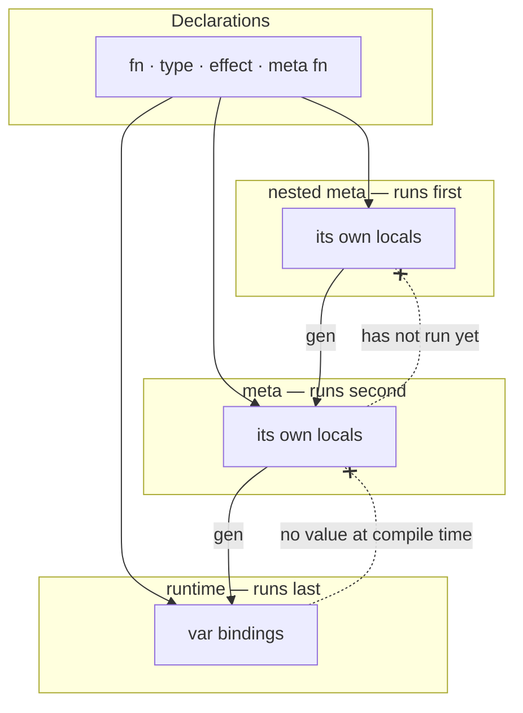
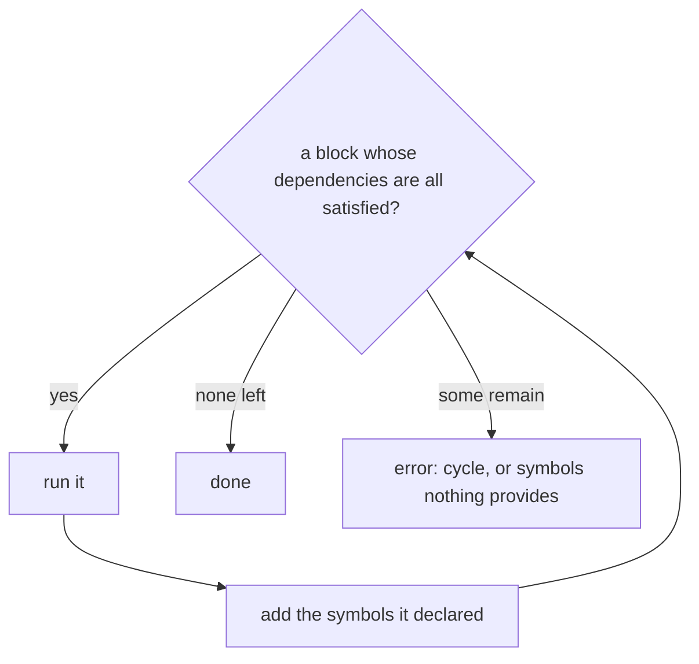

# Metaprocessing

A `meta` block runs while the program is being compiled. Reaching one means compiling and running its dependencies, then continuing where compilation left off — so metaprocessing is recursive compilation.

## Two things, not one

**`meta` runs code at compile time.** Its output happens during compilation, before the program runs at all:

```cronyx
print("Top");
meta {
    print("Middle");
}
print("Bottom");
```

```
Middle
Top
Bottom
```

**`gen` emits code into the program.** The statement after it is captured as syntax and spliced in at the meta block's position, so it runs at runtime like anything else:

```cronyx
print("Top");
meta {
    gen print("Middle");
}
print("Bottom");
```

```
Top
Middle
Bottom
```

Same block, one keyword apart, opposite ordering. `gen` outside a meta block is an error.

## What `gen` captures

Raw AST, not a value — but every name in it is checked against the meta environment on the way out.

**If the name is not bound at compile time**, it is emitted as an identifier and resolved later, in the program the code is spliced into.

**If it is bound**, its value is *reified* — turned back into the syntax that denotes it. A number becomes a literal, a list becomes a list literal, a struct becomes a struct literal.

**If its type cannot be reified**, that is an error at the `gen`. A closure has no literal form, and neither does anything else whose value cannot be written down.

Reifiability is derived from the type rather than declared: a value is reifiable when everything inside it is, and a function is where that bottoms out. Nothing is written to opt in. See [Reify](Reify.md).

```cronyx
var y = 4;
meta {
    gen var x = y + 5;
}
print(x);        // 9
```

`y` is a runtime variable, so it is not bound at compile time. It stays `y`, and `y + 5` is evaluated at runtime.

Whereas a meta-bound name is written out as its value:

```cronyx
meta {
    var names = ["alice", "bob"];
    gen print(names);
}
```

emits `print(["alice", "bob"])`.

Compare a meta-bound name, which is baked in:

```cronyx
meta fn derive(T) {
    gen fn type_name(self) -> string {
        return T.name;
    }
}
```

`T` is a meta parameter, so it is substituted while collecting.

Substitution also reaches **name positions** — a declaration's name, a call's callee, a struct type — which is what makes generated declarations possible. A meta variable holding a string becomes the identifier:

```cronyx
meta {
    var names = ["alice", "bob", "charlie"];
    for (name in names) {
        var fn_name = "greet_" + name;
        gen fn fn_name() {
            print("Hello " + name);
        }
    }
}

greet_alice();
greet_bob();
greet_charlie();
```

```
Hello alice
Hello bob
Hello charlie
```

`fn_name` is not the function's name; its *value* is. Each turn of the loop emits a declaration called `greet_alice`, `greet_bob`, `greet_charlie`, with `name` baked into each body as a literal.

So a name in generated code is an identifier unless the meta environment binds it to a string, in which case it is that string. The same rule covers both positions: only string bindings substitute into names, and only scalar bindings substitute into expressions.

**The emitted nodes do not go through the rest of compilation inside metaprocessing.** They are handed back to the enclosing compilation and continue from the stage the meta block interrupted. Generated code is checked and lowered exactly once, as part of the program it lands in.

## Nesting

A meta block inside a meta block is processed while the outer one is being compiled, so the innermost runs first:

```cronyx
print("A");
meta {
    print("B");
    meta {
        print("C");
    }
    print("D");
}
print("E");
```

```
C
B
D
A
E
```

`C` during the compilation of the outer block, `B` and `D` when that block runs, `A` and `E` at runtime.

## Processing is unconditional

Because a nested block is processed while the enclosing one is compiled, the enclosing block's control flow has no bearing on whether it runs:

```cronyx
meta {
    if (false) {
        meta { print("C"); }
    }
}
```

```
C
```

`C` is printed while compiling the outer block. The outer block then runs, evaluates `false`, and does nothing.

Three separate things, worth keeping apart:

- **Processing** a nested meta block happens during compilation of its parent, unconditionally.
- **Splicing** puts `gen` output at the position the meta block occupied — which, for a nested block, is inside the parent's body rather than in the program.
- **Executing** spliced code follows ordinary control flow, so a statement generated inside a branch that is never taken never runs.

So control flow decides what *executes*, never what gets *processed*.

## Meta functions

A call to a `meta fn` is evaluated during metaprocessing, and the call is replaced by whatever it produced. What that means depends on position:

```cronyx
meta fn fib(n) { ... }

var x = fib(10);          // expression: replaced by 89, reified
```

```cronyx
meta fn derive_name(T) {
    gen fn type_name(self) -> string { return T.name; }
}

derive_name(Dog);         // statement: replaced by the gen output
```

Four rules follow:

- **Arguments must be known at compile time.** `fib(read_int())` is an error naming the argument.
- **Meta functions may call ordinary functions.** The boundary is *when* code runs, not which code.
- **Meta function names do not exist at runtime.** `var f = fib;` is an error; there is nothing to bind.
- **Results must be reifiable**, the same restriction `gen` substitution has.
- **Calls are not memoized.** Calling a meta function a hundred times evaluates it a hundred times.
- **One call may do both** — return a value *and* `gen` declarations. Both land at the call site: the value replaces the call, the generated nodes are spliced beside it.

`meta fn f(n)` and `fn f<n: int>()` both demand compile-time arguments, so it is worth being clear about the difference:

| | `meta fn f(n)` | `fn f<n: int>()` |
|---|---|---|
| Body runs | at compile time | at runtime |
| Call site becomes | the result | a call to a specialized copy |
| Emits code | via `gen` | no |
| Exists at runtime | no | one copy per argument |

`meta fn` produces code or values. `<>` specializes code.

## Symbol resolution

This is the part that differs most from ordinary compilation. Normally a pass sees the whole program; a meta block sees only what exists at the moment it runs.

Three things run at three different times, and what each can see follows from that:



Declarations reach every level, because they are compiled from the dependency graph rather than bound by execution. Everything else is bound by something running, and the arrows only point one way: an earlier stage cannot see what a later one will bind.

`gen` is the only edge that crosses a level, and it crosses in the other direction — code written at one level is placed in the one that runs after it.

| Visible to a meta block                      |     |                                    |
| -------------------------------------------- | --- | ---------------------------------- |
| file-level `fn`, `type`, `effect`, `meta fn` | yes | compiled as dependencies           |
| its own locals                               | yes | it is running                      |
| an enclosing meta block's locals             | no  | that block has not run             |
| runtime `var` bindings                       | no  | they have no value while compiling |
| declarations below it in the file            | ?   | undecided                          |
| imported symbols                             | ?   | undecided                          |
| symbols another meta block generated         | ?   | undecided                          |

**Runtime variables are not in scope.** `var y = 4;` has no value while compiling — it is a binding the program will make later. That is exactly why `gen var x = y + 5;` works: `y` is unbound at compile time, so it passes through as an identifier.

**A nested block cannot evaluate its parent's locals.** It is processed *before* the enclosing block runs, so anything the parent binds does not exist yet, and referring to it is an error:

```cronyx
meta {
    var msg = "hello";
    meta {
        print(msg);        // error: msg is not bound
    }
}
```

`gen` is the way across, because it does not evaluate `msg` — it emits the identifier. The emitted code lands in the parent's body, and by the time the parent runs, `msg` is bound:

```cronyx
meta {
    var msg = "hello";
    meta {
        gen print(msg);    // prints "hello" when the outer block runs
    }
}
```

That is what lifting a level means. The nesting is lexical, the ordering is not, and `gen` is what moves code from one to the other.

### Generated symbols

A meta block may use what another one generated. That is what makes metaprogramming compose, and it is the hardest part of the design, because the dependency is not visible until the generating block has run.

Two kinds of use, with different consequences:

**Resolved after metaprocessing.** Ordinary code referring to a generated symbol imposes no ordering — every meta block has finished by the time names are resolved, so a call may sit above the block that generates it, and the generated name may be computed:

```cronyx
greet_alice();

meta {
    var names = ["alice", "bob"];
    for (name in names) {
        var fn_name = "greet_" + name;
        gen fn fn_name() { print("Hello " + name); }
    }
}
```

**Needed in order to run.** A meta block calling a generated function must wait for the block that generates it. Ordering follows whatever can be seen statically, and when that is not enough the block runs against a symbol that does not exist yet, which is an error naming the symbol.

No rule restricts what may be generated. A block whose generated names are computed simply cannot be depended on by another block, and finding that out is an error rather than a rejection at the definition. Execution order can get smarter later; the failure is the honest answer until it does.

Processing is a worklist rather than a single ordering:



Two ways it ends badly, and they need different messages. A **cycle** — A needs what B generates and B needs what A generates — should report the chain, `A → B → A`, not a set. **Stuck** blocks that are not cyclic are waiting on a name nothing provides, and the message should name the symbol rather than the block.

Improving the order later only turns errors into successes, never changing what a working program means. Nothing about generation is order-sensitive, because generated code is not a category of its own: once metaprocessing is done, `meta` is gone and the emitted declarations are ordinary ones. Two blocks generating the same name is the same error as writing the same name twice by hand, checked on the finished program by the ordinary rule, and no order avoids it.

**Generated symbols resolve late.** Because names are resolved after all metaprocessing, generated code can be referenced from anywhere in the unit, including above the block that generates it:

```cronyx
greet("Brendan");

meta {
    gen fn greet(name) {
        print("Hello, " + name);
    }
}
```

## Generated code is ordinary code

Once metaprocessing finishes, `meta` and `gen` are gone and what they emitted is indistinguishable from what was written by hand. Everything downstream follows from that rather than needing its own rule:

- Two blocks generating the same name is the same error as writing that name twice.
- A generated `var x` binds the same `x` any surrounding code binds. There is no hygiene mechanism because there is no separate category of name.
- Generated code is type checked, elaborated, and lowered by the ordinary passes, once, as part of the program it landed in.

## The evaluator is a parameter

Metaprocessing does not contain an evaluator; it takes one. Anything that can run the compiled form will do — today the tree-walking interpreter, later codegen plus a runtime, or something else entirely.

That keeps the recursion honest: compiling a meta block runs the same pipeline the program uses, and the thing at the end of that pipeline is supplied rather than assumed. It also puts limits where they belong. A step budget for runaway compile-time computation is the evaluator's business, not the compiler's, and until it becomes a problem an infinite loop in a meta block is a developer error like any other infinite loop.

The same applies to what compile-time code may do. It can do anything the evaluator permits. Restricting file access or nondeterminism is a sandboxing decision for whatever is passed in, not a rule the language needs to state.

## What it needs

**A dependency graph.** Running a meta block does not require compiling the whole program, only what that block transitively references. Evaluation order follows the graph, and a cycle — a block depending on something whose definition depends on that block — is an error with a message rather than a hang.

**Self-contained output.** Generated nodes carry fresh ids and every node they reference, so splicing them cannot collide with or dangle into the tree they came from.

**A symbol table that rejects duplicates.** The Rust bootstrap registers provided names into a `HashMap<String, usize>` (`staged_forest.rs:92`), so a second provider of the same name silently replaces the first. Registration has to fail instead, or the ordinary duplicate-definition rule never gets the chance to fire.

**A position to splice into.** `gen` in statement position emits statements; in expression position, one expression. The two are different modes and only one is valid in a given context.

## Open questions

None. See [TODO](TODO.md) for what is deferred.
