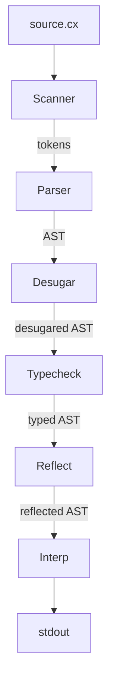

# bootstrap2 architecture

```mermaid
flowchart TD
    src["source.cx"]
    src --> scanner["Scanner"]
    scanner -->|"tokens"| parser["Parser"]
    parser -->|"AST"| desugar["Desugar"]
    desugar -->|"desugared AST"| check["Typecheck"]
    check -->|"typed AST"| reflect["Reflect"]
    reflect -->|"reflected AST"| interp["Interp"]
    interp --> out["stdout"]
```
