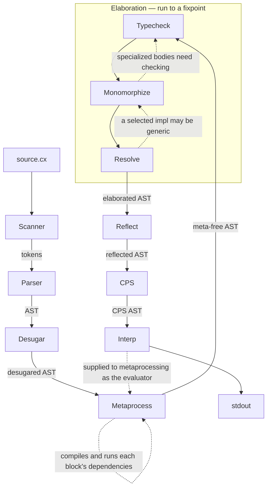

# bootstrap2 architecture

Every pass that constructs nodes invents their type annotations rather than getting them from inference — `Resolve` when it turns an operator into a call, `Monomorphize` when it copies a body, `CPS` when it builds continuations. Those annotations are checked, not trusted. The tree is verified after each such pass.

The case that makes it necessary rather than tidy is effect rows. `CPS` decides what to convert by reading the row off a call's annotation, so a synthesized call carrying an empty row is skipped, and the program performs an unhandled effect at runtime with no compiler error anywhere.
