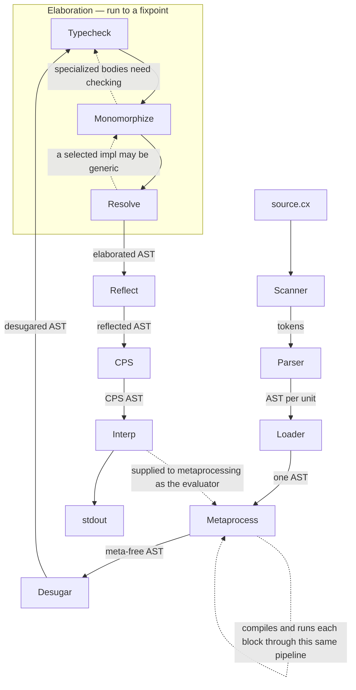

# bootstrap2 architecture

**Metaprocessing runs on surface syntax**, before `Desugar`, because `gen` captures a statement as written — every later IR has dropped that shape, and `Desugar` asserts it never sees a `meta` node. `Loader` precedes it for the same reason: an import is resolved on surface syntax too, and the whole compilation is one program by the time anything else runs.

The dashed self-edge is literal. A meta block is compiled by the passes in this diagram, in this order, and run by the interpreter at the end of it. There is no second pipeline and no compile-time subset of the language.

Every pass that constructs nodes invents their type annotations rather than getting them from inference — `Resolve` when it turns an operator into a call, `Monomorphize` when it copies a body, `CPS` when it builds continuations. Those annotations are checked, not trusted. The tree is verified after each such pass.

The case that makes it necessary rather than tidy is effect rows. `CPS` decides what to convert by reading the row off a call's annotation, so a synthesized call carrying an empty row is skipped, and the program performs an unhandled effect at runtime with no compiler error anywhere.

## `Reflect` answers a type's questions

`Reflect` runs after checking, because that is when a node carries the annotation it reflects, and before evaluation, so the interpreter never sees one. It replaces each question asked of a type with the answer, and erases itself.

`Type` is one of three types that belong to compilation rather than to a program: [`Code`](Metaprocessing.md#code-builds-syntax-gen-emits-it) is captured syntax, and `Name` is an identifier generated code can be given.

**`Type` is comptime-only, and that is a rule rather than a consequence.** A type means nothing once the compiler is gone, so it cannot reach runtime: `typeof(x)` on its own is an error, and a program writes `typeof(x).name` or `typeof(x).shape`. Zig draws the same line, and `@typeName` is its way across.

**A type is not uniformly a thing with fields**, so what it says about itself is a sum — the same choice Zig makes with `@typeInfo`. `.shape` is `Scalar`, `Product` of fields, `Sum` of variants, or `Other`, and a deriver matches on it: comparing fields and matching variants are different jobs, and the shape is what tells them apart. `Other` is honest about what reflection does not describe yet — functions, tuples, arrays.

`TypeShape`, `TypeField` and `TypeVariant` are declared in the prelude and built by the compiler, which is the one place the prelude is reachable from it. The names are long because the prelude is a single namespace and a program is free to declare its own `Shape`; they belong to a `reflect` module once the prelude is a file.

**Answers are one level deep.** A field reports its name and not its type, so a type that mentions itself describes itself in finite space. That is what keeps the fold possible: everything an ask can produce is a literal, so `Reflect` builds it here rather than deferring. Giving a field the type it holds is what breaks that — `type Node { next: Node }` would not terminate — and it is the change that turns reflection from a substitution this pass performs into a call the evaluator makes, answering on demand against the type table.

**Its next consumer runs early.** A deriver walks a type's shape during metaprocessing, which sits before the main `Typecheck`. That works because each meta block is compiled in full and has its own table, but it means reflection will be used in two places rather than occupying one box.

A sum names its variants nowhere but the table the checker built, so this pass reads `Typecheck.ctx_types` — a late pass reaching into the checker's state, which is the shape of the problem [remediation 19](Remediation%20of%20Builtins.md) records.
